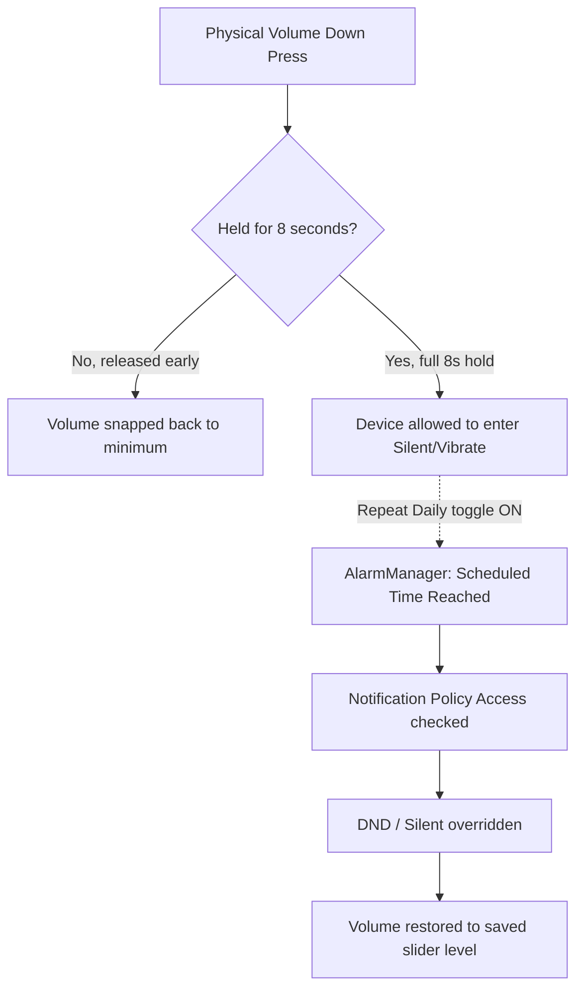

<div align="center">

# 🔇 Unmute It

**A stealth Android Accessibility Service that makes sure you never miss a call again — and gives your phone a real, native cron-job volume scheduler.**


-blue)


<sub>No launcher icon. No app drawer entry. It lives inside your OS.</sub>

</div>

---

## 📖 Table of Contents

- [Why Unmute It](#-why-unmute-it)
- [Features](#-features)
- [How It Works](#-how-it-works)
- [Installation](#-installation--setup)
- [Technical Details](#-technical-details)
- [Roadmap](#-roadmap)
- [Disclaimer](#-disclaimer)

---

## 💡 Why Unmute It

Ever slid the volume rocker one notch too far and missed a call for hours? **Unmute It** fixes that at the OS level — not with a floating app you have to remember to open, but as an invisible Accessibility Service that camouflages itself to match your exact OEM skin (Samsung One UI, Vivo Funtouch, Pixel Stock, and more).

---

## ✨ Features

<table>
<tr><td>🛑</td><td><b>Accidental Mute Prevention</b><br/>Intercepts volume-down presses. Drag it to zero, it snaps back to a safe minimum instantly.</td></tr>
<tr><td>⏳</td><td><b>Intentional 8-Second Override</b><br/>Really want silence? Hold Volume Down for a full 8 seconds. That's the only way in.</td></tr>
<tr><td>📳</td><td><b>Forced Vibration Bypass</b><br/>Uses <code>USAGE_ALARM</code> audio attributes to punch through OEM firmware-level haptic suppression (e.g. Vivo) on incoming calls.</td></tr>
<tr><td>⏰</td><td><b>Native UI Cron-Job Scheduler</b><br/>Schedule auto-unmute at any time, with a "Repeat Daily" toggle that re-arms itself every 24h — a true cron job, no app open required.</td></tr>
<tr><td>🔓</td><td><b>DND-Aware</b><br/>Acquires Notification Policy Access so the scheduler can pull your phone out of Silent/Vibrate/DND on schedule.</td></tr>
</table>

---

## ⚙️ How It Works



The service sits inside **Settings → Accessibility**, disguises its UI using `Theme.DeviceDefault.DayNight` to match the host OS styling, and never registers a launcher activity — so it's invisible to the app drawer by design.

---

## 🚀 Installation & Setup

```bash
# 1. Clone
git clone https://github.com/adityasingh03rajput/unmute-it-.git
cd unmute-it-

# 2. Build & install
./gradlew installDebug
```

Then, on-device:

1. Go to **Settings → Accessibility → Unmute It**
2. Toggle **Enable the Service**
3. Tap the ⚙️ **gear icon** to open the native scheduler menu
4. *(Optional)* Grant **Do Not Disturb access** so the scheduler can override Silent/Vibrate mode automatically

> There is no app icon on your home screen — that's intentional. Access it only through system Accessibility settings.

---

## 🔧 Technical Details

| | |
|---|---|
| **Target SDK** | 34 (Android 14) |
| **Core Architecture** | `AccessibilityService` + `PreferenceFragmentCompat` + `AlarmManager (Exact)` |
| **Theming** | `Theme.DeviceDefault.DayNight` — strips AppCompat styling, inherits raw OS-level styles for OEM camouflage |
| **Audio Bypass** | `USAGE_ALARM` attribute on vibration payloads to defeat firmware haptic suppression |
| **Scheduling** | Exact alarms with self-rescheduling 24h loop for daily repeat |

---

## 🗺️ Roadmap

- [ ] Per-app volume profile overrides
- [ ] Multiple schedule slots (not just one daily window)
- [ ] Quick Settings tile fallback for non-Accessibility flows
- [ ] Wear OS companion trigger

---

## ⚠️ Disclaimer

This project uses Android's Accessibility API and Notification Policy Access for legitimate personal device-automation purposes (volume safety and scheduling). It is intended for use on your own device only. Misuse of Accessibility Services to monitor or control devices without the owner's consent violates Android's platform policies and is not the intended use of this project.

---

<div align="center">
<sub>Built by <a href="https://github.com/adityasingh03rajput">Aditya Singh Rajput</a></sub>
</div>
